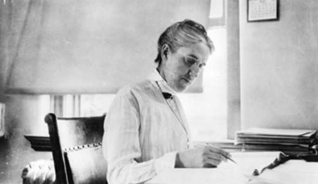

## Distance Estimates from Cepheid Period-Luminosity Relationship

A Project submission for Developing Data Products

---

## Cepheid Period-Luminosity Relationship


Henrietta Swan Leavitt (1868 - 1921), American Astronomer

Relationship between star's observed magnitude and period

"Periods of 25 Variable Stars in the Small Magellanic Cloud", Leavitt, H. S. & Pickering, E. C., *Harvard College Observatory Circular*, **173**, 1 (1912)

---

## Estimating Distances - Mathematics

The Cepheid's period and apparent magnitude can be measured from Earth.  Using the Period-Luminosity Relationship, we can determine the absolute magnitude.

Apparent ($latex Mag_{app}$) and absolute magnitude ($latex Mag_{abs}$) are related by distance ($latex D$):

$latex
 Mag_{abs} = Mag_{app} - 5 ((\log_{10}{D}) - 1)
$

Distances to Cepheids can therefore be estimated.

---

## Estimating Distances - Code

Model fits to Leavitt's Cepheid data are computed using a linear model:

```{r, eval=FALSE}
fitCephData <- function(cephData) {
  fitMax <- lm(absMag~log10(Period),data=cephData[cephData$magVal=="Max",])
  fitMin <- lm(absMag~log10(Period),data=cephData[cephData$magVal=="Min",])  
  return (list(fitMax,fitMin))
}
```

The function relating apparent magnitude, absolute magnitude and distance.  Example: Vega's apparent and absolute magnitudes are 0.03 and 0.58 respectively, which gives a distance of 25 light years:

```{r}
distObj <- function(absMag,appMag) {
  return (parsec*(10^(((appMag-absMag)/5)+1)))
}
parsec <- 3.26156
distObj(0.58,0.03)
```

---

## Using the Shiny App

The Shiny app plots Leavitt's original data and uses that as a model for estimating distances to other Cepheids.

To use the Shiny app, the user needs to feed in two parameters - period and apparent magnitude.  The app will then compute the absolute magnitude and distance.

More details on the background and usage are found within the app itself.
